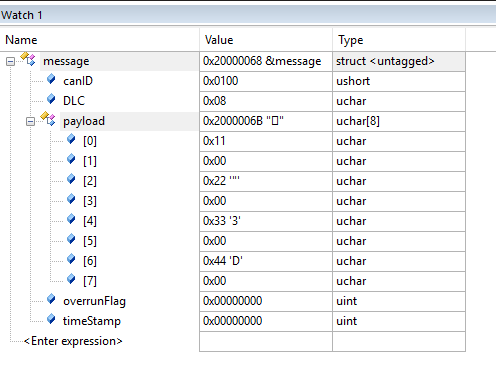
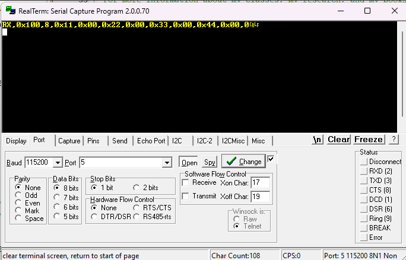
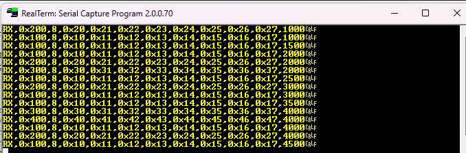
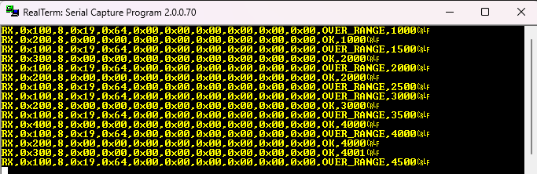
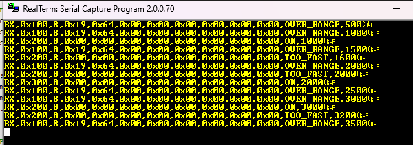
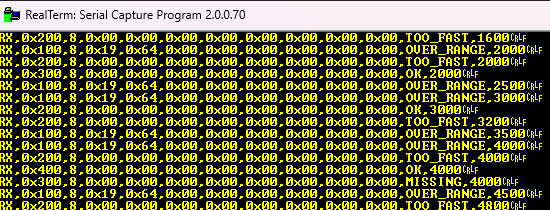
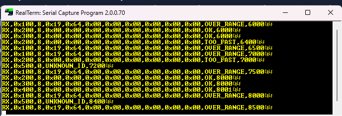
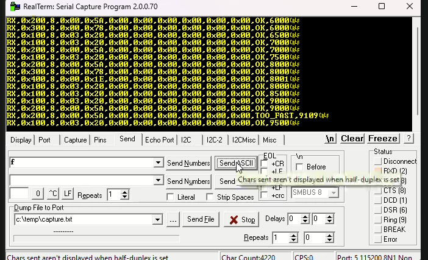
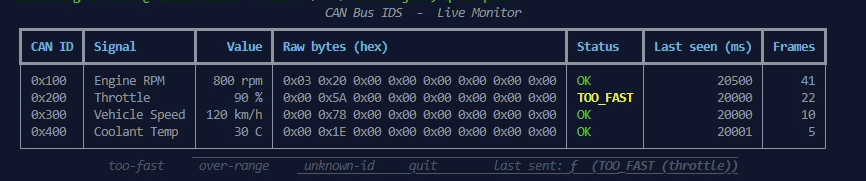
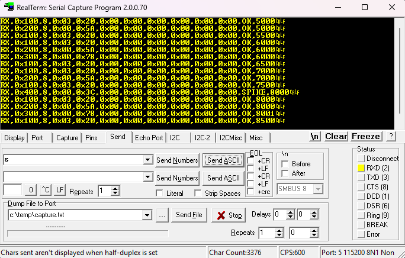

# ARM-BareMetal-CAN-IDS

**A simulated multi-ECU automotive CAN network featuring a custom firmware-level Intrusion Detection System (IDS).**

## Project Overview
This project simulates a secure, multi-node automotive controller area network (CAN) entirely on a single ARM Cortex-M4 microcontroller (MSP432E401Y) using bare-metal C. 

By leveraging the dual built-in CAN controllers (CAN0 and CAN1) routed through external physical transceivers, this system creates two independent hardware nodes operating on a shared physical bus:
* **Node 1 (Engine ECU):** Broadcasts realistic automotive telemetry (RPM, throttle, speed, and temperature) at standard vehicular message rates.
* **Node 2 (Body Control Module):** Actively listens, processes, and responds to the network traffic.

## At a Glance

A bare-metal automotive CAN intrusion detection system on a single ARM Cortex-M4 (MSP432E401Y). Dual on-chip CAN controllers wired through real transceivers into a two-node bus, written from raw registers with no vendor HAL. Five anomaly detectors, an on-demand fault-injection framework driven over UART, and a live Python dashboard.

| Detection | What it catches | Method | Verified on hardware |
|-----------|-----------------|--------|----------------------|
| **Over-range** | A signal past its physical limit (RPM > 6000) | Per-frame value check in the RX interrupt | ✅ RPM forced to 6500, flagged every frame |
| **Too-fast** | A message arriving faster than its schedule (replay / injection) | Inter-arrival timing vs. expected period | ✅ Extra throttle frame every 1600 ms, flagged |
| **Missing** | A message that stops arriving (silenced / dropped node) | Deadline watchdog scanned in the main loop | ✅ Speed silenced 2 s, flagged on the deadline, recovers on resume |
| **Unknown ID** | A frame from an ID outside the known network (rogue ECU) | Hardware catch-all message object + match priority | ✅ Rogue 0x500 flagged, known IDs untouched |
| **Spike (rate-of-change)** | A value that stays in range but jumps faster than physically possible (in-range spoofing) | Frame-to-frame delta vs. a per-signal limit | ✅ Coolant forced 30 → 60 C, flagged once on the jump |

**Interactive:** every attack is triggerable live from the host with a single keypress over UART, and the dashboard shows each signal decoded into real units with color-coded status. Detection spans three axes: **value** (is it possible?), **timing** (too fast, or gone?), and **identity** (does this ID belong?), plus a rate-of-change rule for spoofing that stays within legal bounds.

Full implementation, the debugging stories, and the design decisions behind each detector are in the milestones below.

## Phase 1: Hardware Setup & Bare-Metal Initialization
* **External Hardware:** Utilized SN65HVD230 CAN transceivers for physical communication. The modules include built-in 120Ω termination resistors across the CANH and CANL headers.
* **MCU Configuration:** Located and mapped the specific registers and GPIO pins responsible for CAN communication on the Cortex-M4.
* **Bit Timing:** Researched CAN bit timing architecture and calculated the appropriate Baud Rate Prescaler (BRP) using the standard bit rate formula to establish a stable connection.

Transceiver Used:


### Wiring Setup
The physical bus uses a twisted-pair configuration to resolve electromagnetic interference (EMI) and maintain signal integrity.


**The Physical Bus (Backbone)**
* `CANH` on Transceiver 1 <---> `CANH` on Transceiver 2
* `CANL` on Transceiver 1 <---> `CANL` on Transceiver 2
(These two wires are twisted together between the nodes).

**Node 1 (CAN0 - Engine ECU)**
* `VCC`  -> MCU 3.3V
* `GND`  -> MCU Common GND
* `TXD`  -> MCU Pin PA1 (CAN0TX)
* `RXD`  -> MCU Pin PA0 (CAN0RX)

**Node 2 (CAN1 - Body Control Module)**
* `VCC`  -> MCU 3.3V
* `GND`  -> MCU Common GND
* `TXD`  -> MCU Pin PB1 (CAN1TX)
* `RXD`  -> MCU Pin PB0 (CAN1RX)

## Milestone 1: TX/RX Proof of Life

The first integration milestone: a single CAN frame transmitted from CAN0, received by CAN1 across a physical two-node bus, and parsed out of the receiving message object. No CAN library used

**What this proves**
- Both CAN controllers brought up from raw registers with a bit timing for 500 kbps (BRP=14, TSEG1=12, TSEG2=3) and message-object configuration using the IF1/IF2 indirect interface
- CAN0 transmits a standard 11-bit frame
- CAN1 receives it, and the firmware reads the frame back out of the message object (`WRNRD=0`) and parses ID, DLC, and the 8 payload bytes into a `Msg` struct

**Verified result**: debugger watch window after one TX → RX cycle:



## Milestone 2: Stream live CAN traffic to a host PC using UART

**Why UART2:** Enabling CAN0 (jumpers JP4/JP5) reassigns PA0/PA1 away from
UART0, so per the board user guide UART2 (PD4/PD5) becomes the XDS-110
backchannel.

**Config:** 115200 8-N-1, PIOSC clock (IBRD 8 / FBRD 44); PD4/PD5 muxed to
UART2 alternate function, Port D clock enabled.

**Trace format** — `Message_Object_UART_Print()` emits fixed CSV
`DIR,ID,DLC,payload…,timestamp`:

```
RX,0x100,8,0x11,0x00,0x22,0x00,0x33,0x00,0x44,0x00,0
```

UART2 CAN trace in RealTerm

## Milestone 3: Multi-ECU Bus + Interrupt-Driven Monitor

Simulate a realistic multi-ECU CAN bus and monitor it live. Four ECUs broadcasting on independent schedules. The node receiving every frame through interrupts and streaming it to UART on RealTerm

**TX:** Sends four message objects at their own periods -> RPM (0x100, 500ms), throttle (0x200, 1s), speed (0x300, 2s), and coolant (0x400, 4s). Different CANIDs for all

**RX:** CAN1 uses one message object per ID (we can do a total of 32) with receive interrupts enabled. The ISR (CAN1_IRQHandler) identifies the message object using CANINT, drains the pending objects using a loop, and hands it off to main using the flag bitmask. Main prints each frame using UART2 after checking if the specific bit of the flag bitmask is set. After printing, it clears that bit from flag.  

Multi-ECU trace in RealTerm

> Design note: RX is interrupt-driven so the monitor never stalls the TX
> scheduler and never misses a frame; the ISR stays short (capture only),
> with the UART print moved to main (slower than the ISR in general)

## The Intrusion Detection System (IDS)
Running concurrently on the same Cortex-M4 core is a lightweight, custom-built Intrusion Detection System. It actively monitors the raw bus traffic to detect and flag common automotive cybersecurity threats and anomalies, including:
* **Timing Violations:** Detecting messages sent outside their expected timing windows.
* **Unexpected Message IDs:** Flagging unauthorized or unknown device IDs attempting to transmit on the bus.
* **Value Check:** Identifying impossible (or out of range) values for certain properties such as RPM, Vehicle Speed, Throttle, and Coolant Temperature. 

## Test — OVER_RANGE Detection (Value Check)
Every property has been given a maximum value. Anything over this value would be an anomaly. Every message struct has also been given a status which is used for UART printing.  `ENGINE_RPM` is set to 6500 (0x1964 in payload array) which is GREATER than the maximum threshold value of 6000 
The rest have a payload under their maxValue threshold. We expect the RPM status to be 'OVER_RANGE' and the rest to be 'OK'

UART output testing message status 

## Test — TOO_FAST Detection (Frame Injection)

The IDS flags a message arriving faster than its defined period

**Setup:** an attacker block injects an extra throttle frame (ID 0x200) every 1600 ms, off the event's normal 1000 ms schedule. The legit throttle ECU keeps its own rhythm untouched.



**Mistakes on the way here:**
- Tried injecting with a blocking delay loop. This only froze the scheduler and shifted every timestamp, because `ticks` runs in hardware regardless of a busy-wait. *Lesson: inject traffic, not delays.*
- First attacker block fired on the loop index and flooded every message. *Lesson: target one specific victim.*

A design choice was made here: To account for jitter such as arbitration delays for lower-priority CAN IDs (it can be seen for 0x400 that it arrives 1ms later than the rest due to the scheduling), the IDS has not been hardcoded to say that a normal send on the right time is OK even though it was only flagged TOO_FAST due to an earlier attacking send which was TOO_FAST itself. 

## Test — MISSING Detection (Silencing an event for a specific time period)

The IDS flags a message that *stops arriving*. A dropped, disconnected, or attacker-silenced node.

**Setup:**  suppress a victim's transmissions for a window. I target
VEHICLE_SPEED (2 s period), silencing it from t=2.5 s to t=4.5 s so it misses its
4 s slot, then recovers.



**How I got here (and what I learned):**
- First tried to fake it with delays and disabled-interrupt tricks, all failed,
  because `ticks` runs in hardware and a busy-wait just freezes the scheduler.
  Realized (same lesson as TOO_FAST) you inject by changing *traffic*, not *time*. We can work
  here by *removing* a transmission rather than adding one.
- Initially buried the logic inside `CAN0_Transmit` with an early
  `return` if the time period was met. It worked but was working on the BUS side in a CAN function. Wanted to move it to main, so had to use abstraction.

SPEED is flagged MISSING exactly once on the edge, stays silent, then re-arms and returns to OK when it resumes at 6 s. Makes the full trip

## Test — Detecting Unknown IDs (Promiscuous)

A frame shows up with an ID that isn't supposed to be on the bus at all is being flagged by the IDS in this case



My first instinct was to make a clear software flagging system which would go across the array of IDs and see if the incoming ID is allowed or not. Then, I learned about CAN's own acceptance filtering system in the MCU. We originally set every event's ID into the transmit setup function which set everyone up with specific IDs at the start. Anything other than this would not be accepted. However, the mask bits and registers exist for this exact reason. 

I added a new object in the setup and made it 'catch-all'. Its ID mask set entirely to 'don't care' which accepts everything. The ID field was left cleared in the arbitration 2 register to make sure it is not accepting only one specific number. The MCU stores a received frame in the lowest-numbered object that matches. Therefore, the known IDs fall in their own registers and are never flagged. Anything unknown automatically makes it to the next available object that we just put in (object 5). This means that any ID in that object is unknown and therefore invalid. 

The ISR is responsible for checking and declaring any status changes to the event. The ISR checks in the NEW object (5) and if something exists there, it means it has an invalid ID and therefore needs to be flagged to UNKNOWN_ID

**A bug I faced for a while.** My first iteration of this implementation flooded the entire bus with constant UNKNOWN_ID and MISSING lines. Every ID read 0x0. This was because of the way I handled the message array and its size after adding another object. I changed the preprocessor constant NUMBER_OF_EVENTS to 5 to match the new number of objects. However, this also meant that the loops running in main, CAN0/CAN1 Receive_Setup/Transmit_Setup, were all going one extra iteration. That pulled the uninitialised object 5 into the scheduler which always ran because ticks - lastTransmitted >= period now meant ticks - 0 >= 0. The fix was to keep the constant same, BUT increase the size of the message array by 1 -> `message[NUMBER_OF_EVENTS + 1]`. The new object does not need to go through the for loop which targets the main 4 objects.

**Testing it:** Created a new functin called `INJECT_UNKNOWN_ID` which takes in the message, a timer, and an index. The index would be the `new object number - 1` -> `5 - 1 = 4`. This function sends a message with the message ID 0x500 on the bus using ticks and the attacker timer from main. It sends the message every 1200ms. If known IDs were leaking into this catch-all, they would also be flagged, which is not the case right. 

## Traffic Visualization
The firmware is interfacing with a custom Python dashboard that visualizes the live bus traffic over a serial connection. It will log standard telemetry while instantly flagging network anomalies and spoofing attempts in real time.

Up to this point the UART link was one-way. To make the IDS demoable from a user's perspective, I made it bidirectional. The host can send a single character, the firmware injects the matching attack, and the detector lights up in real-time



The initial trap with reading UART characters in the main loop is the blocking nature of the UART_Inchar function. It uses a while loop to keep checking the UART Flag `UART_FR_R` register. While it waits, the CAN system freezes. Therefore, a rather different system was implemented. Check the flag only once per function call, and set a software flag which we set if there is data waiting in the buffer. Then, return that char from the UART RX input. The main function looks for the flag and its value on every run, and when it is set to 1, it chooses between a set of characters using a switch case statement. Based on the character, specific attacker functions are called

My first injectors were time-based and ran every few ms. However, this new feature allows the user (attacker) to send in attacks at any time. The three are not the same kind of events, so one-shot means something different for each:
- `f` (too fast): transmit one off-schedule throttle frame
- `o` (over-range): force the RPM value high which persists as a stuck value until a manual reset. 
- `u` (unknown ID): sends one rogue data frame with an ID outside of the allowed IDs (0x500). shows up as an unknown ID everytime we send it in

**Result:** From the host machine (laptop's Realterm) we can trigger any attack and watch the matching data flip status live. The normal traffic is not affected. Result can be seen in the image above. ps. video demos on Notion. 

The python dashboard has been added to keep the latest result in front of us for better live observations. Result can be seen in the image below



## Test — SPIKE Detection (Rate-of-Change)

This is the detector I designed after spotting a gap in the other four. OVER_RANGE catches a value that crosses its ceiling, but it says nothing about a value that stays inside the legal range and simply jumps to an impossible degree. An attacker spoofing a believable value, even if it is wrong will result in a reading that looks legal.



**The idea.** A real physical signal can only change so fast. An engine can't gain 4000 RPM in half a second, and coolant physically cannot jump 30°C in one 4-second frame. So instead of checking a value against a ceiling, I check the *delta between consecutive frames* against limit. Each message keeps a `lastValue` and a `maxMargin`; when a new frame arrives, if the jump from the last value exceeds the margin, it's status is flagged as SPIKE.

A spoofed value can be both out of range and a huge jump. I decided OVER_RANGE wins that tie. It is more specific, so the spike check only fires when the frame isn't already flagged over-range.

**Testing:** `INJECT_SPIKE` forces COOLANT_TEMP from its original 30°C to 60°C which is a 30-degree step that's thermally impossible in one frame, but still far below the 120°C ceiling, so only the rate check can catch it. On the next coolant frame it's flagged SPIKE once on the jump, then settles to OK at the new level. The spike is the transition, not the new value. The other signals and the over-range path stay untouched.